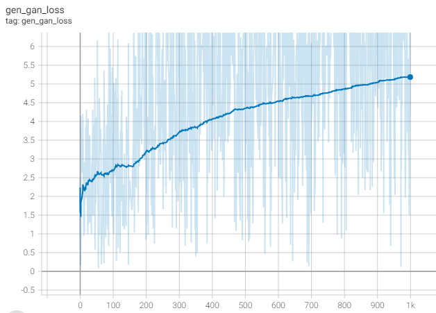
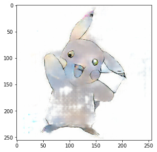

# Pix2Pix 구현해보기

[텐서플로 공식 튜토리얼](https://www.tensorflow.org/tutorials/generative/pix2pix)을 보고 [Sketch2Pokemon Dataset](https://www.kaggle.com/norod78/sketch2pokemon)에 적용시켜보는 프로젝트

### 진행 상황

- 2021-03-28 : 프로젝트 시작
- 2021-03-28 ~ 2021-03-29 : 첫 번째 모델 학습 및 결과 확인
- 2021-03-29 ~ 2021-03-30 : 두 번째 모델 학습 및 결과 확인
- 2021-03-30 ~ 2021-04-01 : 모델 서비스화 진행 중
- 2021-04-02 : Ainize로 서비스 배포

기존에 AIFFEL 노드에서 학습했던 방법으로 잘 학습이 되지 않아서 공식 튜토리얼을 보고 다시 따라하였다.

기존과의 차이점이라고 한다면 이미지를 Normalize 해주는 시점이 조금 다르다는 것이다. 아마 이 부분에서 문제가 생겨서 위와 같은 이미지가 학습된 것으로 보인다.

이미지 데이터를 다룰 때에는 항상 Normalize, Denormalize에 신경써야 하는 것 같다. 어떤 Activation Function을 사용하느냐에 따라 Normalize 범위를 [-1, 1]로 할지, [0, 1]로 할지가 결정되기 떄문이다. 이번에 사용된 모델에서는 tanh를 Activation Function으로 사용했기 때문에 [-1, 1]의 범위에서 Normalize 해주었다.

우선 시작부터 1000 epoch 정도를 돌려보고 시작하기로 했다.

- 400 epoch 정도 부터 큰 변화가 없는걸로 보아 local minima에 빠졌거나 학습이 종료된 것 같다.
- 750 epoch 의 checkpoint를 불러와서 기울기를 1/10으로 줄여서 50 epoch 정도 더 학습을 시켜보았으나 큰 변화는 없는 것 같다.
- 750 epoch 의 checkpoint를 불러와서 기울기를 10배로 늘려서 50 epoch 정도 더 학습을 시켰더니 오히려 원하지 않는 방향으로 학습이 진행되었다.

## 결과

- 1000 epoch
- Discriminator Loss

- Generator Loss

두 Loss를 비교해봤을 때, disc_loss는 감소하고 gen_loss는 증가하는 것으로 보아 generator가 discriminator를 속이기 위한 이미지를 잘 생성하지 못하는 것으로 판단된다. 실제로 train과 test에 없는 전혀 새로운 이미지를 입력했을 때, 다음과 같이 잘 생성하지 못하는 결과를 보여줬다.

학습 과정을 시각화해보면 다음과 같다.

기존에 있는 이미지는 원본이랑 비슷한 정도로 생성하는 것으로 보아 train set에 overfitting 된 것 같다. 추가로 다른 데이터셋을 더 활용하거나, 모델의 구조를 바꾸어서 다시 학습시켜봐야겠다.

[사용한 모델 링크](https://drive.google.com/file/d/1v1t2AXEb94rvw32Zj24_9dmQj2_58vB2/view?usp=sharing)

## 문제점들

- 프론트엔드/백엔드 지식이 전혀 없어서 HTML부터 공부해서 페이지를 제작함
- Inference 결과 tensor object로 반환되어 해당 object를 바로 웹에서 rendering 가능한 방법을 찾다가 결국 이미지로 저장하여 rendering 하는 방식으로 진행
- 페이지는 정상적으로 만들어졌는데 계속해서 기존의 이미지를 가져옴 -> 브라우저 쿠키 문제
- model의 크기가 100MB가 넘어가서 git lfs를 이용하여 git에 업로드 하였으나 Ainize에서 불러오지 못하는 문제가 발생
- heroku에서 배포를 시도하였으나 메모리 용량 부족(500MB)으로 배포 실패
- 기본 git lfs 용량을 모두 사용하여 개인 웹서버 이용하여 모델 다운로드 후 Ainize로 배포

## 수정해야 할 것
- input 이미지 크기 조절
- output 이미지 원본 사이즈로 반환 

## 느낀점

- 모델을 만들어서 학습시키고 실행 가능한 python 파일로 정리하는 것 까진 어렵지 않았는데 웹페이지를 구축하는 게 가장 어려웠다. 단순 텍스트 데이터가 아닌 이미지 데이터를 웹에서 띄우는 방법을 몰라 html을 공부해서 겨우 띄울 수 있게 되었는데 브라우저 캐시 때문에 정상작동 하는 걸 오작동으로 인식하여 다른 방법을 찾았다.
- 결국 프론트엔드를 공부하고 있는 sunhpark에게 도움을 요청하여 js로 웹페이지를 좀 더 깔끔하게 만드는 데 성공했다.
- 로컬에서 테스트 할 땐 잘 되었는데 막상 배포하려고 하니 적절한 서비스가 없었다. 우선 git에 모델 용량이 100MB를 초과해서 git lfs를 이용하여 Ainize로 배포를 시도하였으나 디버깅 하다가 git lfs 무료 사용량을 전부 사용하여 다른 서비스를 찾아보았다.
- heroku로 배포를 시도했을 땐 메모리 용량 부족으로 실패하였다.
- 마지막 남은 EC2는 1년만 무료여서 최후의 보루로 남겨두고 Ainize로 배포해보기 위하여 무료 파일 서버 서비스를 찾아보았지만 마땅한 게 없어서 결국 임시로 웹서버를 만들어서 Ainize에서 Dockerfile을 빌드할 때 모델을 받아올 수 있도록 하였고, 결국 성공하였다.

웹페이지 제작에 도움을 준 사람 : [sunhpark](https://github.com/sunhpark42)
